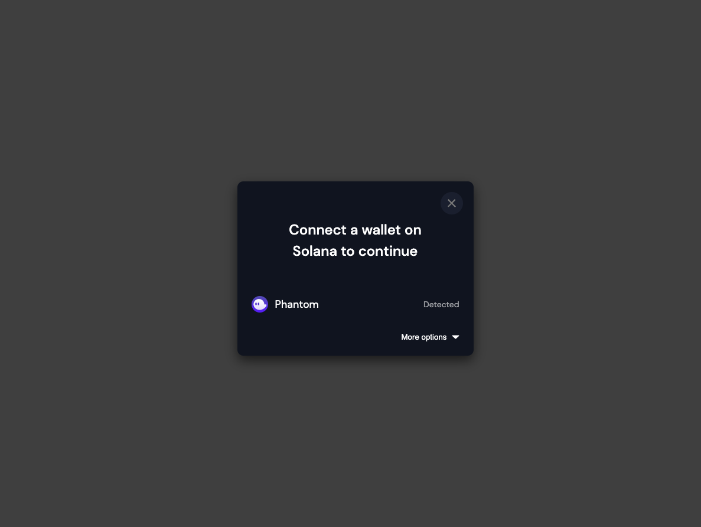

This is a basic example of the Solana wallet adapter bootstrapped with a NextJs project. The example will run out of the box with the option to select a wallet.

## Getting Started

To run the example locally, run the commands below and specify an appropriate port number.

```bash
npm install
npm run dev -p 7500

# or

yarn install
yarn dev -p 7500
```

## Screenshots

### 1. Sample landing screen with Select Wallet button center of screen
<br>


### 2. Modal menu when Select Wallet button is clicked with Phantom detected
<br>



### 3. Wallet options
<br>

