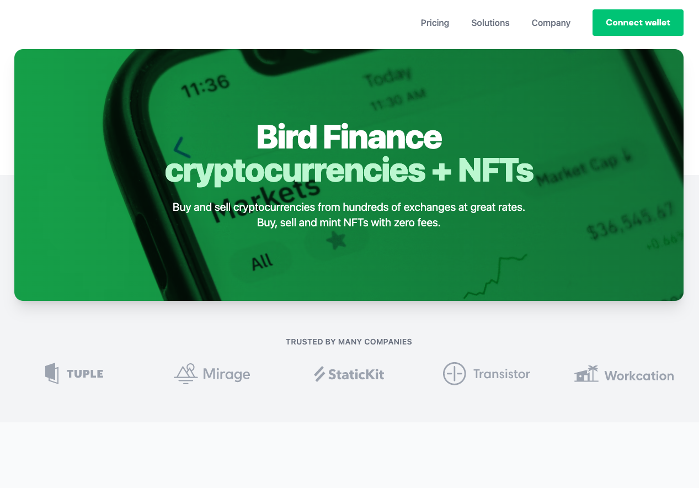
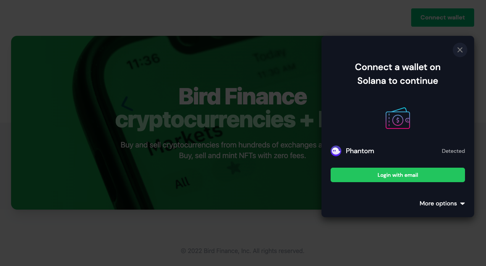
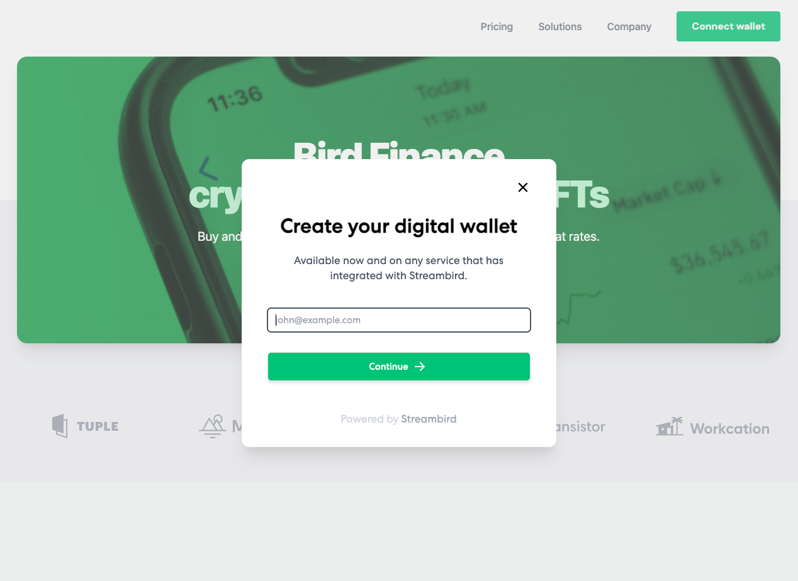
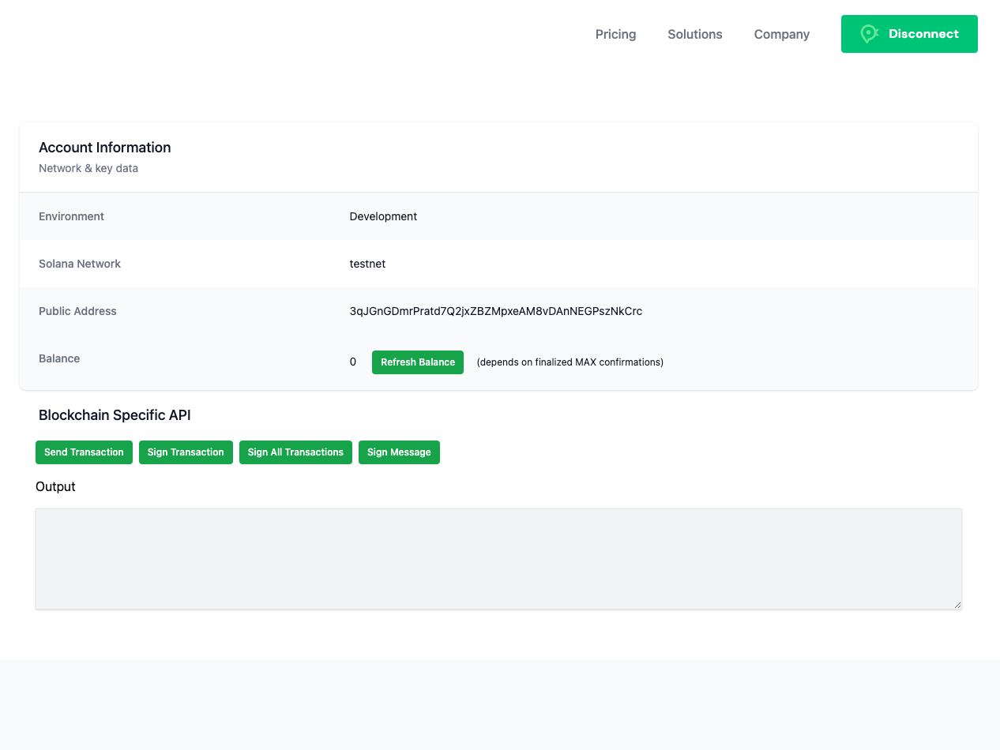

This is a complex custom example of the Solana wallet adapter bootstrapped with a NextJs project. The example will show case a custom modal which extends from the Solana wallet UI components. The design has a Get Started button with an option to show more wallet adapters.

Once logged into Streambird, you will be shown options to interact with your wallet like sign transaction, send transaction, sign message and sign all transactions.

If you are testing send transaction, make sure you have some SOL in your test wallet and you can refresh the balance once you make a transaction. 

You can use something like https://solfaucet.com/ to add SOL into your wallet (testnet or devnet).

## Getting Started

To run the example locally, run the commands below and specify an appropriate port number.

```bash
npm install
npm run dev -p 7504

# or

yarn install
yarn dev -p 7504
```

## Screenshots

### 1. Sample landing screen with Connect Wallet button.
<br>



### 2. Modal shown with Get Started button
<br>



### 3. After Get Started is clicked the login screen is shown
<br>



### 4. When login is successful a dashboard is depicted 
<br>



