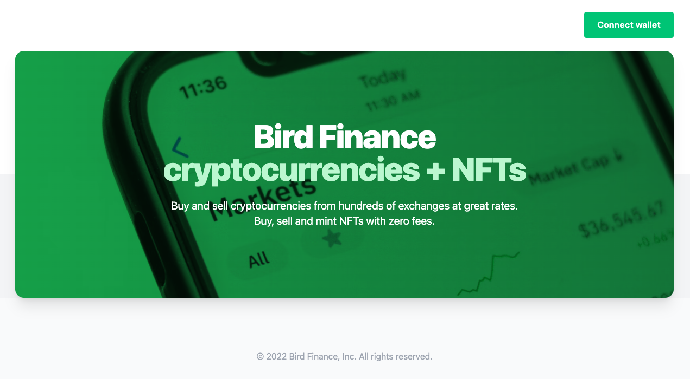
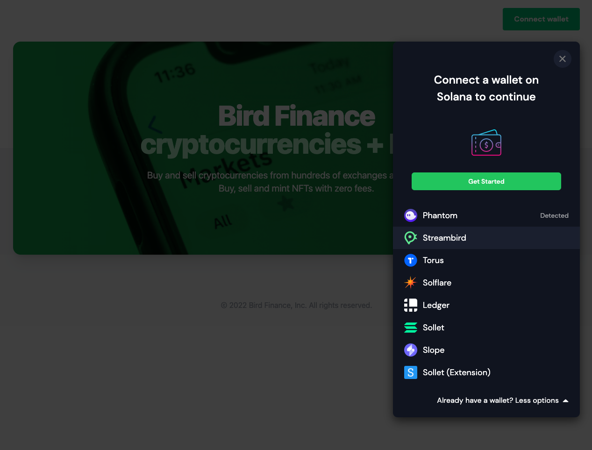
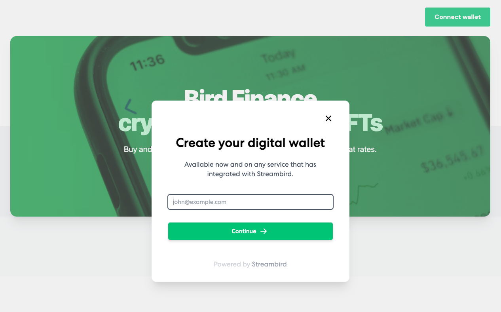

This is a custom example of the Solana wallet adapter bootstrapped with a NextJs project. The example will show case a custom modal which extends from the Solana wallet UI components. The design has a Get Started button with an option to show more wallet adapters.

## Getting Started

To run the example locally, run the commands below and specify an appropriate port number.

```bash
npm install
npm run dev -p 7501

# or

yarn install
yarn dev -p 7501
```

## Screenshots

### 1. Sample landing screen with Connect Wallet button.
<br>




### 2. Modal menu when Connect Wallet button is clicked
<br>


### 3. Wallet list with Streambird wallet highlighted.
<br>



### 4. Streambird login screen when Streambird wallet selected.  
<br>



