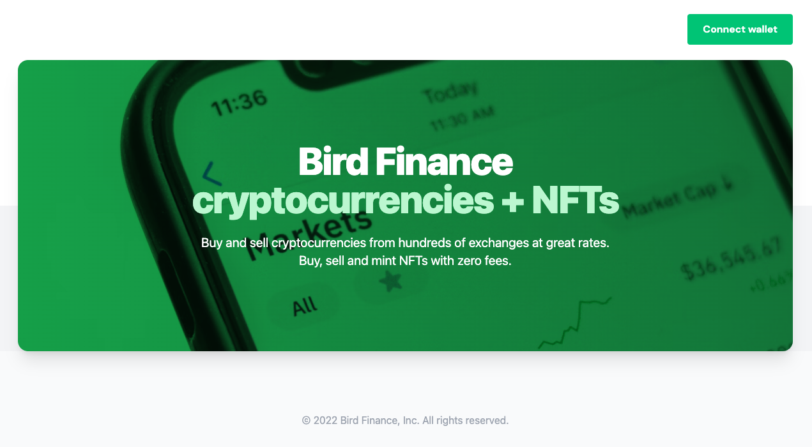
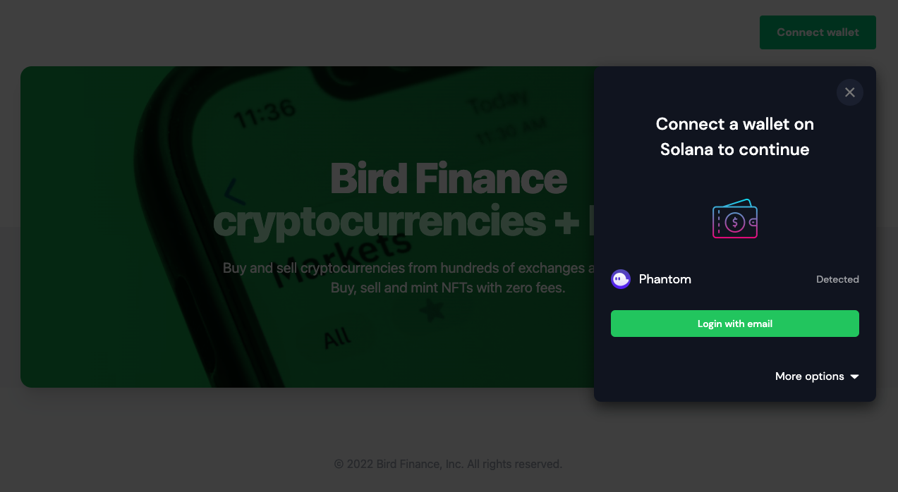
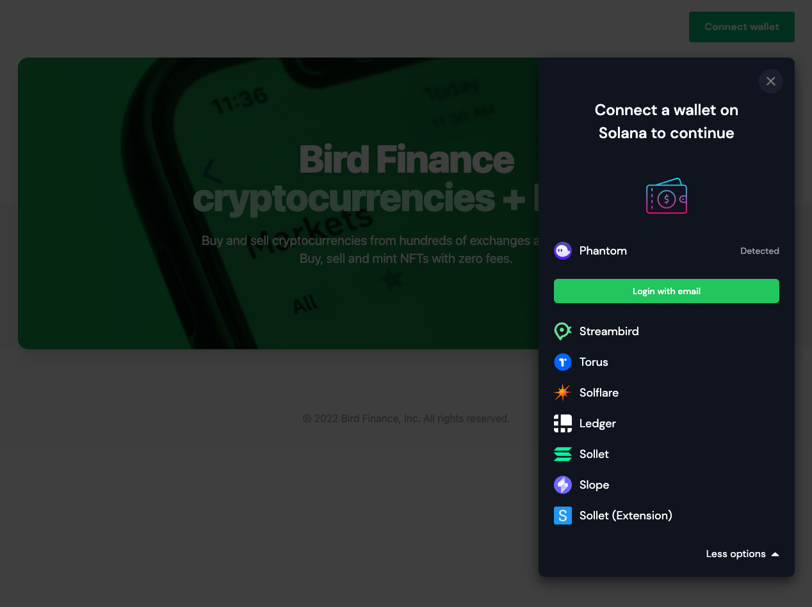
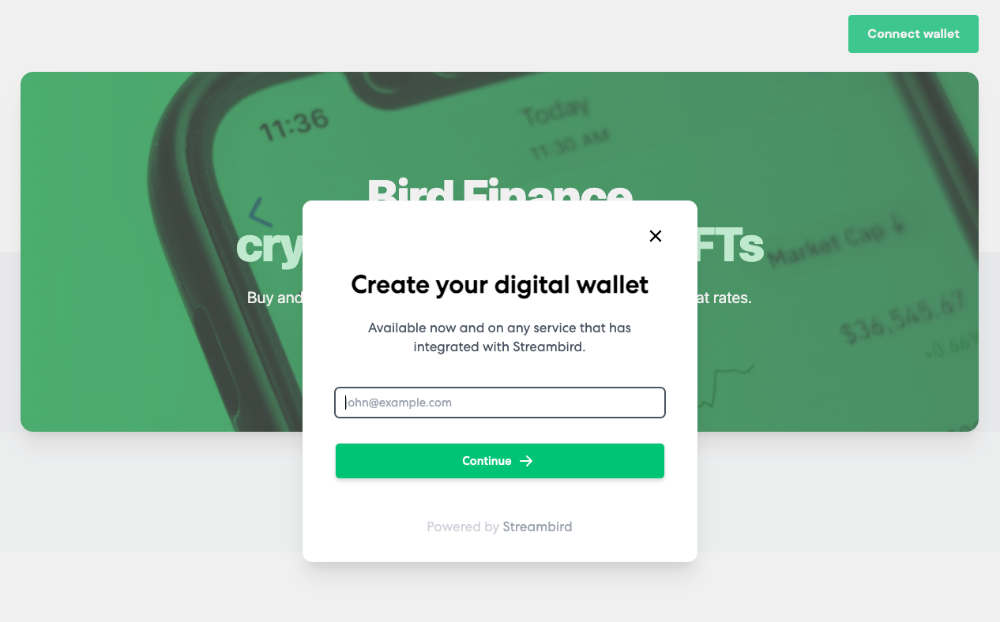

This is a custom example of the Solana wallet adapter bootstrapped with a NextJs project. The example will show case a custom modal which extends from the Solana wallet UI components. 

The design has Phantom or another wallet if detected to select from, as well as a Login with email button. If those options are not applicable then you can choose a wallet from the more options.

## Getting Started

To run the example locally, run the commands below and specify an appropriate port number.

```bash
npm install
npm run dev -p 7502

# or

yarn install
yarn dev -p 7502
```

## Screenshots

### 1. Sample landing screen with Connect Wallet button
<br>




### 2. Modal menu when Connect Wallet button is clicked
<br>



### 3. Wallet list with Streambird wallet highlighted
<br>



### 4. Streambird login screen when Streambird wallet selected
<br>



